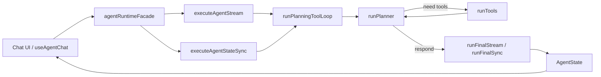

# 🤖 AI Agent 对话系统

基于 React + TypeScript 的多会话 AI Agent 应用，当前采用前端本地运行时实现 `planner -> tool -> final` 三段式流程，支持流式输出、工具调用、Markdown 渲染与代码块复制。

---

## 🔄 1. 项目重构情况同步

### ✅ 1.1 架构重构（已完成）

- 对外运行时入口统一为：
  - `executeAgentStream`（流式主入口）
  - `executeAgentStateSync`（同步状态入口）
- 新增 `agentRuntimeFacade` 作为 Hook 与运行时之间的唯一边界层，`useAgentChat` 不再依赖历史多命名 API。
- 历史入口 `executeAgentGraph*`、`executeAgentStateStream` 保留为兼容层，不作为业务主链路。

### ✅ 1.2 代码优化（已完成）

- Planner 阶段补齐工具决策消息入栈逻辑（在需要调用工具时写入 `state.messages`）。
- 流式可靠性增强：
  - 处理“无 chunk”与“空白 chunk”场景，避免 UI 出现空回复。
  - 避免在已有 partial 输出后直接拼接 fallback，减少内容混杂。
- `useAgentChat` 改为可读取流式 `done` 返回状态，在前端层做最终文本兜底，提升鲁棒性。

### ✅ 1.3 结构调整（已完成）

- UI 消息渲染链路从纯文本升级为 Markdown 渲染。
- 新增代码块组件 `CodeBlock`，支持语言标签与一键复制。
- 减少低价值控制台输出，保留关键告警信息（配置缺失、关键错误）。

---

## 🗺️ 2. 下一步详细工作计划（目标：替换 RESPONSE API）

> 目标：将当前以 Chat Completions 风格为主的调用方式，平滑迁移到统一的 **RESPONSE API** 适配层，降低模型供应商差异带来的维护成本。

### ⏱️ 2.1 执行步骤与时间逻辑

| 阶段 | 时间 | 目标 | 产出 |
|---|---|---|---|
| Step A | 第 1-2 天 | 设计适配层接口 | `ResponseAdapter` + 统一请求/响应 DTO |
| Step B | 第 3-4 天 | 完成非流式路径迁移 | planner/final 通过 adapter 调用 RESPONSE API |
| Step C | 第 5-6 天 | 完成流式路径迁移 | 流式 chunk 规范化、错误语义统一 |
| Step D | 第 7 天 | 工具调用对齐 | tool call 结构映射、兼容旧模型字段 |
| Step E | 第 8-9 天 | 灰度与回滚开关 | `REACT_APP_USE_RESPONSE_API` Feature Flag |
| Step F | 第 10 天 | 收尾与文档测试 | 删除冗余路径、补齐 README/测试说明 |

### 🔗 2.2 依赖项

- 供应商端 RESPONSE API 可用性与鉴权稳定性。
- LangChain/SDK 对目标字段（工具调用、流式事件）的兼容情况。
- 现有 `agentService` 测试可作为迁移回归基线。

### ⚠️ 2.3 主要风险点与应对

- 风险 1：流式事件格式差异导致 UI 断流或空消息。  
  应对：先构建“事件归一化层”，统一 `text/tool/error/done` 事件。

- 风险 2：工具调用字段命名差异导致 Planner 解析失败。  
  应对：在 adapter 中做双向字段映射，保留兼容解析。

- 风险 3：迁移期间线上行为波动。  
  应对：Feature Flag 灰度放量，支持一键回滚旧链路。

---

## 🌟 3. 项目亮点总结（面向面试官）

### 🧩 亮点一：三段式 Agent 运行时（Planner/Tool/Final）

**亮点说明**  
将“理解与规划”“外部执行”“最终生成”拆分为三阶段，避免单次 LLM 黑盒调用，具备可观测与可控能力。

**伪代码**

```pseudo
state = init(messages)
while state.step < maxSteps:
  plan = planner(state.messages)
  if plan.needTools:
    state.messages += assistant_tool_decision(plan)
    toolResults = runTools(plan.toolCalls)
    state.messages += toolResults
    continue
  break
final = finalizer(state.messages)
return final
```

**实现原理**  
通过 `AgentState` 持有阶段状态与消息上下文，Planner 只做决策，Tool 层只做执行，Final 层只做汇总回答，职责边界清晰。

### 🌊 亮点二：流式鲁棒性设计（防空回复/防混杂）

**亮点说明**  
对“空 chunk、空白 chunk、流式异常”做了显式处理，避免 UI 出现空气泡或错误文本与 partial 混合。

**伪代码**

```pseudo
hasMeaningful = false
for chunk in stream:
  text = extract(chunk)
  if text.trim() != "":
    hasMeaningful = true
  if hasMeaningful:
    yield text

if !hasMeaningful:
  syncText = invokeSyncFallback()
  yield syncText
```

**实现原理**  
将“是否真正输出有效文本”作为状态信号，只有在确认无有效输出时才触发兜底，降低误判。

### 📝 亮点三：Markdown + 代码块独立渲染（含复制按钮）

**亮点说明**  
消息正文与代码展示分离，代码块具备语言标识、独立样式和复制功能，提升可读性与实用性。

**伪代码**

```pseudo
renderMarkdown(content):
  if node is inlineCode:
    renderInlineCode(node.text)
  if node is fencedCode:
    codeText = extractCodeText(node.children)
    renderCodeBlock(codeText, language, copyButton=true)
```

**实现原理**  
对 Markdown AST 的 `code` 节点做组件级接管，避免默认渲染不可控，同时支持后续扩展（主题、行号、diff 高亮）。

---

## 🧠 4. AGENT 完整工作流程（核心）

### 🏗️ 4.1 架构图描述



### 🧱 4.2 模块划分

- `src/hooks/useAgentChat.ts`  
  会话驱动、消息生命周期、流式消费与持久化。

- `src/api/services/agentRuntimeFacade.ts`  
  对外统一入口，隔离 Hook 与 runtime 实现细节。

- `src/api/services/agentService.ts`  
  Agent 核心：状态创建、规划循环、工具执行、最终生成。

- `src/api/services/chatService.ts`  
  LLM 配置管理（模型、密钥、baseURL）。

- `src/api/services/tavilyService.ts`  
  搜索工具能力封装（供 Tool 层调用）。

- `src/components/MarkdownRenderer.tsx` + `CodeBlock.tsx`  
  回答内容渲染层，负责 Markdown 与代码体验。

### 🔄 4.3 数据流（输入 -> 理解 -> 规划 -> 执行 -> 反馈 -> 输出）

1. **输入**：用户发送文本/图片消息，写入当前会话。
2. **理解**：消息标准化为 `AgentMessage`，补系统提示词。
3. **规划**：Planner 判断是直接回答还是调用工具。
4. **执行**：若需要工具，执行 `search/math` 并写回 `state.messages`。
5. **反馈**：Final 阶段流式或同步生成答案，异常时走兜底策略。
6. **输出**：UI 增量渲染，最终落盘到本地会话存储。

### 💻 4.4 主逻辑伪代码

```pseudo
function executeAgentStream(messages):
  state = createInitialAgentState(messages)
  state = runPlanningToolLoop(state)
  for chunk in runFinalStream(state):
    emit(chunk)
  return state

function runPlanningToolLoop(state):
  while state.step < state.maxSteps:
    state = runPlanner(state)
    if state.nextAction == "run_tools":
      state = runTools(state)
      continue
    return state
  state.finishReason = "max_steps"
  return state
```

### 🧪 4.5 可扩展设计（已预留，当前未全面启用）

- **多工具扩展位**：当前仅 `search/math`，可扩展工具注册中心与权限策略。
- **状态事件流扩展位**：目前主输出是文本 chunk，可扩展为结构化事件流（plan/tool/final/error）。
- **后端接管扩展位**：当前运行时在前端，后续可平迁至 backend 并保留 facade 接口不变。
- **长期记忆扩展位**：`AgentState.messages` 可接入向量检索与摘要记忆策略。
- **多模型路由扩展位**：`createLLM` 位置可插入模型路由器（按任务/成本/延迟选择模型）。

---

## 🚀 5. 快速开始

### 📦 5.1 环境要求

- Node.js >= 16.14.0
- npm >= 8.0.0

### ▶️ 5.2 安装与启动

```bash
cd ai-agent-chat
npm install
npm start
```

默认访问：`http://localhost:3000`

### 🔐 5.3 环境变量

```env
REACT_APP_VOLCANO_API_KEY=your_api_key_here
REACT_APP_API_BASE_URL=https://ark.cn-beijing.volces.com/api/v3
REACT_APP_MODEL_ID=doubao-seed-2-0-pro-260215
REACT_APP_TAVILY_API_KEY=your_tavily_key_here
```

### 🏗️ 5.4 构建

```bash
npm run build
```

---

## 📄 6. 许可证

MIT License
